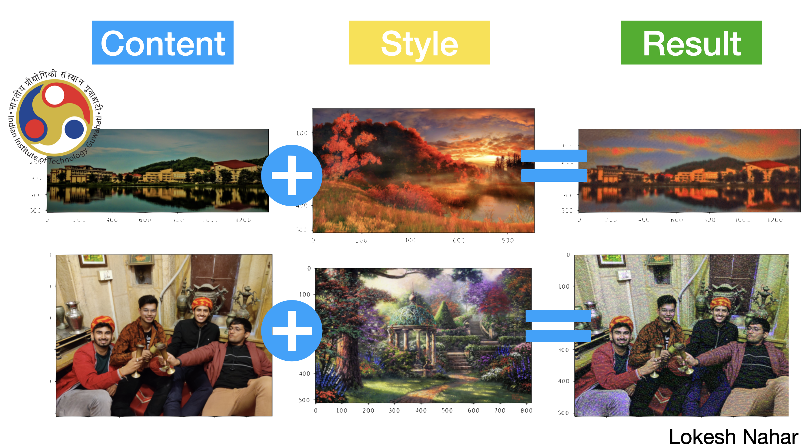

# Image-style-transfer
For a given content image and a style image, the outline and shape of the image are similar to the content image, and the color or texture is changed to be similar to the style image.

The aim of this assignment is to create a deep learning model capable of adapting an existing work to resemble the aesthetic of any art. The model should be able to analyze the artistic style of the selected art and apply similar stylistic features to a new, original artwork, creating a piece that seems as though it could have been created by the artists themselves.



# Requirements
- Python (>=3.6)
- Jupyter Notebook
- Pillow (PIL) (>=7.0.0)
- Matplotlib (>=3.1.1)
- NumPy (>=1.17.2)
- Pandas (>=0.25.1)
- PyTorch (>=1.4.0)
- Torchvision (>=0.5.0)

# Usage
Enter the relative path (or path) of the content and the style images at the required cell
* run the notebook
```
jupyter notebook lokesh_image_style_transfer.ipynb
```
Run all the cells after putting up the path of the images.

* Command for setting up with all the required modules
```
pip3 install -r requirements.txt
```


The Idea is:
A pre-trained VGG19 Net is used as a model to extract content and style. It then uses the losses of the content and style to iteratively update the target image until the desired result is achieved. We divide it into two parts

vgg19.features: All convolutional layers and pooling layers. (We only need this)
vgg19.classifier: The last three linear layers are the classifier layers.


* The images are converted into tensors for computations and arrays for visualisation and display.
